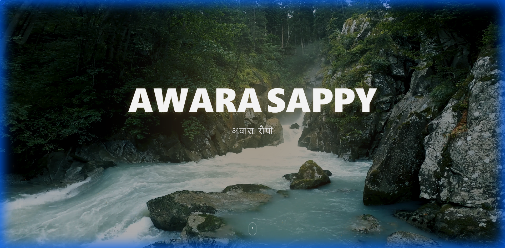
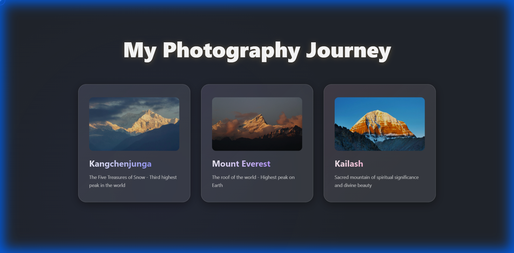
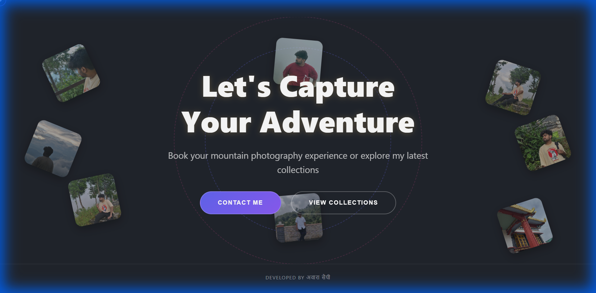

# How It's Made: Awarasappy

This document provides an overview of the technologies and techniques used to build the Awarasappy mountain photography portfolio.

## Technologies Used

The project leverages a modern tech stack to deliver a high-performance, visually engaging experience:

*   **[React](https://react.dev/)**: A JavaScript library for building user interfaces. Used for the component-based architecture.
*   **[Vite](https://vitejs.dev/)**: A build tool that aims to provide a faster and leaner development experience for modern web projects.
*   **[GSAP (GreenSock Animation Platform)](https://gsap.com/)**: A robust JavaScript toolset for high-performance HTML5 animations. Used for the smooth scrolling and entrance animations.

## Project Structure

The project is organized as follows:

*   `src/`: Contains the source code.
    *   `assets/`: Static assets like images and fonts.
    *   `components/`: Reusable React components.
    *   `App.jsx`: The main application component.
    *   `main.jsx`: The entry point.
*   `public/`: Public assets served directly.

## Visual Walkthrough

### Landing Page
The initial view features a striking hero section with a call to action.

### Content Showcase
As you scroll, the gallery reveals stunning mountain landscapes with smooth animations.

### Footer
The bottom of the page provides navigation and contact information.

### Video Walkthrough
Here is a video recording of the website in action, showcasing the animations and user flow.

